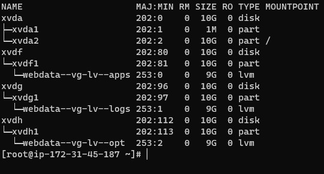

# Devops-tooling-web-solution

In this project, we will make use of the following components:

-Infracstructure: AWS
-3 webservers linux: Red Hat enterprise linux 8
-A database server: Ubuntu 20.04 + MySQL
-A storag server: Red Hat Enterprise Linux 8
-Programming Language: PHP
-Code repository: GitHub

Take a good look at the architecture of the solution we want to make below:

# Set up

Lunch 4 EC2 instances with RHEL linux 8 Operating System.

Name them Web1, web2, web3 and NFS-svr respectively.

Lunch another EC2 instance with Ubuntu 20.04 and name it DB-svr

Create 3 volumes of 10 Gib each and attach them to the NFS-svr server

follow the instruction given in my [workplace-6](https://github.com/olaniyi2oguns/workplace-6.git) repository to create volumes and attach them to corresponding instance.

Use the guide [Here](https://github.com/olaniyi2oguns/workplace-6.git) to create the following  Logical Volumes:

    lv-apps
    lv-logs
    lv-opt
create /mnt directory to serve as mount points for the logical volumes created.

Mount lv-apps on /mnt/apps (this will be used by the webbservers)

Mount lv-logs on /mnt/logs (this will be used by webserver logs)

Mount lv-opt on /mnt/opt  (this will be used by jenkins in the next project)

NOTE: if you follow the insectructions very well you should have the output that looks like the one below after running command `sudo lsblk`

Format the logical volume with xfs filesystem

mkfs -t xfs /dev/webdata-vg/lv-apps

mkfs -t xfs /dev/webdata-vg/lv-logs

mkfs -t xfs /dev/webdata-vg/lv-opt

Bring up your NFS-svr on your terminal and run the following commands one after the other:

`sudo yum -y update`

`sudo yum install nfs-utils -y`

`sudo systemctl start nfs-server.service`

`sudo systemctl enable nfs-server.service`

`sudo systemctl status nfs-server.service`

Export the mounts for the webservers "subnet cidr" to connect as clients. 

To check your subnet cidr – open your EC2 details in AWS web console and locate ‘Networking’ tab and open a Subnet link:

Note: Set up permission to allow web servers to read, write and execute files on NFS. To do this, create owner of the mounts by running the following commands first:

`sudo chown -R nobody: /mnt/apps`

`sudo chown -R nobody: /mnt/logs`

`sudo chown -R nobody: /mnt/opt`

After creating owner, run the following commands to give the permissions:

`sudo chmod -R 777 /mnt/apps`

`sudo chmod -R 777 /mnt/logs`

`sudo chmod -R 777 /mnt/opt`

Then restart you nfs server by running command:

`sudo systemctl restart nfs-server.service`

Configure access to NFS for clients within the same subnet by opening `/etc/exports` file with any texteditor e.g `sudo vi /etc/exports` and paste in the following commands:

    /mnt/apps <Subnet-CIDR>(rw,sync,no_all_squash,no_root_squash)

    /mnt/logs <Subnet-CIDR>(rw,sync,no_all_squash,no_root_squash)

    /mnt/opt <Subnet-CIDR>(rw,sync,no_all_squash,no_root_squash)

Note: Remember to use the subnet-cidr from your webserver instance. 

save and then run `sudo exportfs -arv` command to export.

Check the port used by NFS

`sudo rpcinfo -p | grep nfs` 
if everything is okay you should have output like the one below:

NOTE: In order for NFS server to be accessible from your client, you must also open following ports: TCP 111, UDP 111, UDP 2049

*configuring database server*

Bring up your database server on a new terminal tab.

Note that this server is using Ubuntu linux OS

Install MYSQL on the server `sudo apt install mysql-server -y` and login to the mysql console `sudo mysql`

start mysql:

`sudo systemctl start mysql`

`sudo systemctl status mysql` to check if mysql is up and running

Create database account named tooling

`CREATE DATABASE tooling;`

create user called webaccess with any password of your choice

`CREATE USER 'webaccess'@'<subnet cidr>' IDENTIFIED BY '<password of your choice>';`

Grant access to webaccess user

`GRANT ALL ON tooling.* TO 'webaccess'@'<subnet cidr';`

`FLUSH PRIVILEGES;`

`SHOW DATABASES;`

Then exit mysql console `exit`

Restart mysql `sudo systemctl restart mysql`

*Preparation of webservers*

lunch one of the Webservers e.g web1 on your terminal

Install NFS client on the server

`sudo yum install nfs-utils nfs4-acl-tools -y`

Create a directory called /var/www/ with command `mkdir /var/www/`

Mount /var/www/ and target the NFS server's export for apps

`sudo mount -t nfs -o rw,nosuid <NFS-Server-Private-IP-Address>:/mnt/apps /var/www`

Run `df -h` to confirm that NFS is successfully mounted

Open /etc/fstab file `vi /etc/fstab` and add `<NFS-Server-Private-IP-Address>:/mnt/apps /var/www nfs defaults 0 0`

Install and start apache

`sudo yum install httpd -y`

`systemctl start httpd`

`systemctl enable httpd`

check if the apache is up and running with `systemctl status httpd`

`sudo dnf install https://dl.fedoraproject.org/pub/epel/epel-release-latest-8.noarch.rpm`

`sudo dnf install dnf-utils http://rpms.remirepo.net/enterprise/remi-release-8.rpm`

Install php and its dependencies by running the following commands

`sudo dnf module reset php`

`sudo dnf module enable php:remi-7.4`

`sudo dnf install php php-opcache php-gd php-curl php-mysqlnd`

`sudo systemctl start php-fpm`

`sudo systemctl enable php-fpm`

`setsebool -P httpd_execmem 1`

Confirm that apache files and directories are available on the webserver in /var/www/ with `ls /var/www/` and on the NFS server in /mnt/apps with `ls /mnt/apps`. Create a file in the web server and check if the same file will appear in the NFS server e.g `touch real.txt`

Locate the lof folder for apache on the webserver and mount it to NFS server's export for logs

Open /etc/fstab file `vi /etc/fstab` and add `<NFS-Server-Private-IP-Address>:/mnt/logs /var/log nfs defaults 0 0`

Clone a source code from  to your github account.

To this, you need to first install git on your server

`sudo yum install git -y`

then, initialize git with `sudo git init`

`sudo git clone https://github.com/darey-io/tooling.git`

`ls` to check if you will found tooling directory.

Deploy the tooling website's code to the webserver and make sure that html in the tooling directory is deployed to /var/www/html

`cp -R tooling/html/. /var/www/html`

check if everything is running well on your browser with you webserver public address. You get a page that looks like the one in the image below.

Make sure you disable SELinux by opening the selinux file and disable it

`sudo vi /etc/sysconfig/selinux` then set selinu=disabled

`cd` into `/var/www/html` and update it to connect to the database

`vi /functions.php` and then add the tooling-db.sql script and look for the line that looks like the one in the image below 

and replaced the msql.tooling.svc.cluster.local with your dbserver private ip address and admin with 'webaccess' and the second admin 'with your db webaccess password'. check the image below

install mysql on the webserver

Ensure that you open mysql/arora port on your dbserver security group to connect only to your webserver private subnet cidr

On your db server, ensure that you check the binding address to connect from everywhere (0.0.0.0)

`vi /etc/mysql/mysql.conf.d/mysqld.cnf`

and make sure you restart mysql `sudo systemctl restart mysql`

So, run the command below on the webserver

`mysql -h <database-private-ip> -u <db-username> -p <name of database> < tooling-db.sql`

If it returns no error it means everything is working as expected.

Go back to db server and login to mysql console and check databases, check tooling tables just as shown in the image below

open your broswer and enter this

`http://<Web-Server-Public-IP-Address-or-Public-DNS-Name>/index.php`

If you see the image below, then I greet you congratulations

Enter user name: admin and password: admin and you see

you can click on create user just to have fun around

